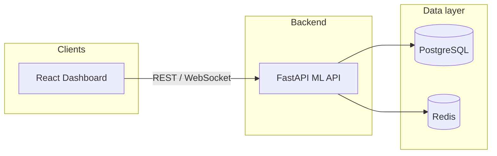

# AI-Powered Self-Optimizing Data Warehouse

A full-stack data warehouse project with **bronze → silver → gold** ETL, a **FastAPI** backend for warehouse metrics and ML-assisted optimizations, and a **React (Vite)** dashboard for monitoring, analytics, and recommendations.

---

## Table of contents

1. [What this system does](#what-this-system-does)
2. [Architecture](#architecture)
3. [Prerequisites](#prerequisites)
4. [Quick start (local development)](#quick-start-local-development)
5. [Docker](#docker)
6. [Dashboard configuration](#dashboard-configuration)
7. [ETL pipeline](#etl-pipeline)
8. [Optional tooling](#optional-tooling)
9. [Repository layout](#repository-layout)
10. [Troubleshooting](#troubleshooting)

---

## What this system does

- **Data warehouse layers** — Staged ingestion and transformation (bronze / silver / gold) backed by **PostgreSQL**.
- **ML optimization API** — Endpoints for recommendations, workload analytics, storage insights, alerts, WebSocket streams, and system activity logging (`ml-optimization`).
- **Dashboard** — Single-page app for operational views, analytics bundles, and optimization workflows (`dashboard`).
- **Caching / coordination** — **Redis** for supported flows (see compose and service configs).
- **Observability (optional)** — **Prometheus** and **Grafana** via compose overrides.

---

## Architecture



Typical **local dev** ports:

| Service            | URL / port                          |
|-------------------|--------------------------------------|
| ML API (default)  | `http://localhost:8000` — `/docs`   |
| Dashboard (Vite) | `http://localhost:5173` (default)   |
| PostgreSQL       | `localhost:5432`                    |
| Redis            | `localhost:6379`                    |

When using **Docker integration** (`docker-compose.integration.yml`), the ML service is often exposed on **8001** and the packaged dashboard on **3000** (nginx). Point the dashboard’s `VITE_API_BASE_URL` at the URL you actually run.

---

## Prerequisites

- **Docker Desktop** (or Docker Engine + Compose) — for PostgreSQL, Redis, and optional stacks.
- **Python 3.10+** — for the ML API, ETL, and helper scripts.
- **Node.js 18+** and **npm** — for the dashboard.

Optional:

- **Git** — version control.
- **PowerShell** — if you use the Windows helper scripts in the repo root.

---

## Quick start (local development)

This is the simplest path that matches the dashboard’s **default** API base (`http://localhost:8000/api/v1`).

### 1. Start PostgreSQL and Redis

From the repository root:

```bash
docker compose up -d postgres redis
```

Wait until Postgres is healthy (Compose prints health status, or use `pg_isready`).

Default DB credentials (override with env vars if you change them):

- **User:** `postgres`
- **Password:** `postgres`
- **Database:** `datawarehouse`

### 2. Install Python dependencies (ML API)

```bash
cd ml-optimization
python -m pip install -r requirements.txt
cd ..
```

If you use a virtual environment, create and activate it first, then run the same `pip install`.

### 3. Start the ML Optimization API

From the **repository root** (important — the loader resolves paths from here):

```bash
python start_services.py
```

You should see:

- **API:** `http://localhost:8000`
- **OpenAPI docs:** `http://localhost:8000/docs`

### 4. Start the dashboard

```bash
cd dashboard
npm install
npm run dev
```

Open the URL Vite prints (by default **http://localhost:5173**).

### 5. Optional: align environment files

- Copy `dashboard/.env.example` to `dashboard/.env` if you need a non-default API URL or WebSocket origin.
- Copy `ml-optimization/.env.example` to `ml-optimization/.env` for ML tuning and Postgres-related options.

---

## Docker

### Base stack (database + cache)

```bash
docker compose up -d postgres redis
```

### Full integration stack (ML service + API gateway + dashboard image)

```bash
docker compose -f docker-compose.yml -f docker-compose.integration.yml up --build
```

Services and ports are defined in `docker-compose.integration.yml` (for example ML service **8001**, API gateway **8000**, dashboard **3000** when using the bundled nginx image). Adjust `VITE_*` build args or your `.env` so the UI targets the correct backend.

### Monitoring (Prometheus + Grafana)

```bash
docker compose -f docker-compose.yml -f docker-compose.monitoring.yml up -d
```

Grafana is typically mapped to host port **3001** (see `docker-compose.monitoring.yml`).

### Development ETL (Airflow)

Optional Airflow services are in `docker-compose.dev.yml`:

```bash
docker compose -f docker-compose.yml -f docker-compose.dev.yml up -d
```

Airflow UI is mapped to **8081** on the host in that file.

---

## Dashboard configuration

| Variable | Purpose |
|----------|---------|
| `VITE_API_BASE_URL` | REST prefix for the ML API (default in code: `http://localhost:8000/api/v1`). |
| `VITE_WS_BASE_URL` | Optional WebSocket origin if it differs from the API origin. |
| `VITE_ANALYTICS_POLL_MS` | Optional analytics polling interval (ms). |

See `dashboard/.env.example` for comments and examples.

---

## ETL pipeline

- Main runner: `etl/scripts/run_etl.py` (Bronze → Silver → Gold).  
- Logs append to `etl/scripts/etl_pipeline.log` when file logging is enabled.
- Cron-style Windows runner: `etl/scripts/run_etl_cron.ps1` (see script header for Task Scheduler usage).

Ensure PostgreSQL is up and schemas/tables exist per your initialization scripts under `infrastructure/docker/postgres/init-scripts` before running heavy loads.

---

## Optional tooling

| Item | Description |
|------|-------------|
| `START_DASHBOARD_AND_API.ps1` | Windows: starts API gateway script path + `dashboard` dev server (review paths if your gateway entrypoint differs). |
| `run_project.ps1` | Windows: checks Postgres, starts ML API + dashboard in separate windows. |
| `scripts/start_dashboard.py` | Starts API + dashboard from one terminal (paths may point at `api-gateway`; prefer `start_services.py` + `npm run dev` if in doubt). |
| `watch_etl*.ps1`, `monitor_etl*.ps1`, `quick_etl_check.ps1` | Windows helpers for ETL progress monitoring. |

---

## Repository layout

| Path | Role |
|------|------|
| `ml-optimization/` | FastAPI app, ML models, routes, `requirements.txt`. |
| `dashboard/` | Vite + React UI, `Dockerfile` / `nginx.conf` for production image. |
| `api-gateway/` | Optional gateway service (used in Docker integration when built). |
| `etl/` | Pipelines, DAGs, scripts, scheduler. |
| `infrastructure/` | Docker configs for Postgres, Prometheus, Grafana, etc. |
| `scripts/` | Utilities, migrations, one-off helpers. |
| `start_services.py` | **Recommended** local entrypoint for the ML API on port **8000**. |
| `docker-compose*.yml` | Compose stacks for core, dev, monitoring, integration. |
| `system log/` | `system_activity.log` append target for dashboard/system events (created by the API when logging). |

---

## Troubleshooting

- **Dashboard shows API errors** — Confirm `python start_services.py` is running and that `VITE_API_BASE_URL` matches the host/port (including `/api/v1` suffix).
- **CORS / WebSocket issues** — Check `VITE_WS_BASE_URL` and that the backend allows your dashboard origin (see ML API CORS settings in `ml-optimization/api/main.py`).
- **Postgres connection refused** — Run `docker compose up -d postgres` and verify port **5432** is not used by another instance.
- **Windows asyncio noise** — `start_services.py` already sets a Selector event loop policy where needed; use that script from repo root.

---
