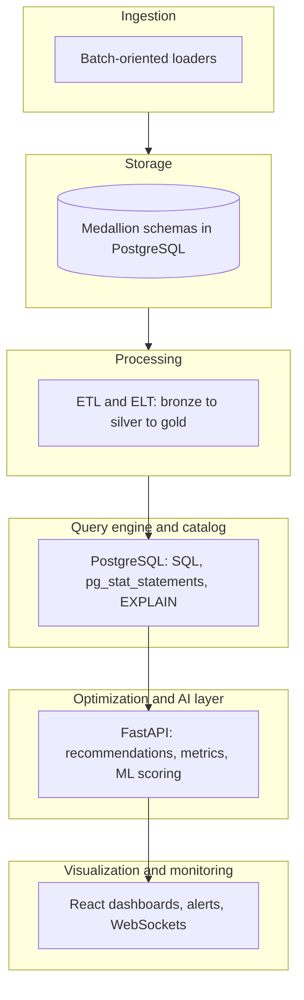

# AI-Powered Self-Optimizing Data Warehouse

**Presentation-ready overview** for academic evaluation: problem framing, architecture, ML design, algorithms, implementation, and a short demo script.

---

## 1. Problem Statement & Motivation

### Limitations of traditional data warehouses

| Limitation | What goes wrong | Why it matters |
|------------|-----------------|----------------|
| **Manual tuning** | DBAs pick indexes, partitions, and parameters by intuition or ad hoc EXPLAIN plans. | Slow iteration; expertise does not scale with data or query growth. |
| **Static physical design** | Schemas and partitioning are fixed at deployment; workload shifts (new reports, seasonality) are not reflected automatically. | Yesterday’s optimal layout becomes today’s full table scan. |
| **Performance bottlenecks** | Hot tables, sequential scans, poor join order, cache pressure. | Latency spikes for analysts and downstream apps; SLA risk. |
| **Cost inefficiency** | Over-provisioning “just in case,” or under-provisioning and firefighting. | Cloud bills and operational load grow faster than business value. |

**Analogy:** A traditional warehouse is like a highway network designed once for morning traffic—if evening patterns change, congestion appears until someone manually adds lanes (indexes) or redraws districts (partitions).

### Why automation and intelligence are necessary

- **Workload is continuous:** Query mix, volume, and data skew change; static rules cannot cover all cases.
- **Signal is abundant:** Execution time, I/O, buffer hits, and query text are measurable—machine learning can turn them into **prioritized actions** (what to index, what to partition, what to watch).
- **Human bandwidth is finite:** Automation proposes candidates; humans (or policy) approve—reducing toil while keeping governance.

---

## 2. System Architecture (End-to-End)

### Layered view

*Plain-text flow (top-down):* **Ingestion → Storage (medallion) → ETL/ELT → PostgreSQL → ML/optimization API → Dashboards.**

**Ingestion (batch + streaming posture)**  
- **Implemented:** Batch-oriented ingestion and ETL-style scripts into **bronze** (raw/near-raw).  
- **Extensible:** The same medallion pattern can accept **streaming** sources (e.g., change streams, CDC) by landing events into bronze with append-only tables or staging topics—this project emphasizes **batch + periodic refresh** for clarity and reproducibility in an academic setting.

**Storage layer**  
- **Primary warehouse:** **PostgreSQL** with **medallion architecture** (**bronze → silver → gold**): progressive refinement, governance, and consumption-ready marts/facts/dims.  
- **Hybrid posture:** Conceptually a **warehouse-centric** design; a **data lake** (object storage + open formats) can sit alongside for cheap archival or ML feature stores without changing the optimization loop’s core idea.

**Processing layer (ETL/ELT)**  
- Transformations promote data across tiers (cleansing, conforming, aggregating).  
- Lineage and freshness concepts support monitoring (“is gold stale?”).

**Query engine**  
- **PostgreSQL** executes analytical and operational SQL; **pg_stat_statements** (when enabled) exposes normalized query text and timing aggregates.

**Optimization / AI layer**  
- **FastAPI** service (`ml-optimization`): collects or reads workload statistics, runs **trained models**, merges **rule-based** catalog checks, and exposes **index**, **partition**, and related recommendations to the UI and APIs.

**Visualization / monitoring**  
- **React (Vite)** dashboards: optimizations, analytics, monitoring, storage, alerts, settings.  
- **WebSockets** (where implemented) push near–real-time updates for optimization and activity.

### Data flow (step-by-step)

1. **Sources → bronze:** Raw or lightly typed data lands via batch jobs.  
2. **bronze → silver:** Cleaning, keys, conforming dimensions, denormalization as needed.  
3. **silver → gold:** Facts/dims, aggregates, business-ready tables for BI and ML features.  
4. **Consumers query gold/silver** (and sometimes bronze for exploration).  
5. **PostgreSQL** records execution statistics (**pg_stat_statements**) and plans.  
6. **Collector** materializes workload snapshots into **`ml_optimization.query_logs`** (and related state).  
7. **ML + rules** score queries and (table, column) pairs → **recommendations** (indexes, partition hints, cache-related signals where modeled).  
8. **Dashboards** show recommendations, monitoring KPIs, and allow **human-in-the-loop** apply/reject workflows where wired.  
9. **Feedback:** New executions after changes refresh stats; models can be **retrained** on updated logs.

---

## 3. Core Innovation: Self-Optimizing Engine

### What “self-optimizing” means here

Not “the database rewrites itself with no oversight,” but a **closed loop**:

1. **Observe** workload (queries, latency, I/O, frequency).  
2. **Infer** pain points (slow patterns, anomalies, skewed columns).  
3. **Recommend** concrete physical-design and tuning actions.  
4. **Learn** from updated telemetry after changes (or from continued traffic).

### Types of optimizations

| Category | Role in this system |
|----------|---------------------|
| **Query optimization** | Identify expensive patterns; correlate with model predictions vs. actuals; surface outliers. |
| **Indexing strategies** | Suggest B-tree (and conceptually other) indexes on high-impact (table, column) pairs seen in predicates/joins. |
| **Partitioning** | Suggest **range-friendly** keys (time / ingest columns) when filters align with partition pruning. |
| **Resource allocation** | Monitoring and cost/storage views support **capacity** decisions; ML can prioritize what to fix first (ROI-style ranking). |

### Feedback loop

- **Telemetry in:** `query_logs` + `pg_stat_statements` + optional anomaly scores.  
- **Models update beliefs:** Retrain predictors/clusterers on fresh logs.  
- **Rules guardrail:** Catalog validation (table/column exists, allowlisted schemas) prevents nonsense DDL.  
- **Human or automated apply:** Apply events and audit trails (where implemented) close the loop.

---

## 4. Machine Learning Component (Detailed)

### Problem the ML stack solves

**Primary:** Predict and rank **which access paths and workload signatures are “expensive” or “anomalous”** so the system can prioritize **index/partition/cache**-style actions instead of treating all queries equally.

**Secondary:** Group **workloads** (clustering) and support **cache behavior** signals where a cache predictor is trained—so optimization is not only “one query at a time” but **pattern-level**.

### Type of learning

| Technique | Use in project | Label / signal |
|-----------|----------------|----------------|
| **Supervised learning** | **Query execution time prediction** (regression): features from logs/plans → predict latency. | Target: `mean_exec_time_ms` (or related). |
| **Unsupervised learning** | **Workload clustering** (e.g., k-means on query/feature vectors). | No explicit label; discovers query “families.” |
| **Anomaly detection** | **Unsupervised / novelty detection** on query metrics (e.g., Isolation Forest–style). | “Unusual” = high severity for recommendations. |
| **Reinforcement learning** | *Not the primary path* in this codebase; could be future work (actions = index add / partition; reward = latency/cost). | N/A today. |

### Features (examples)

- **Query text–derived features:** joins, aggregations, filters, subqueries, estimated cost/rows (when EXPLAIN features are extracted).  
- **Runtime metrics:** `mean_exec_time_ms`, `calls`, buffer hit/read counts, rows affected.  
- **Frequency & scale proxies:** call counts, I/O, table touch patterns inferred from logs.

### Model choices (and intuition)

| Model | Role | Why it fits |
|-------|------|-------------|
| **Gradient boosting (XGBoost)** | Regression on execution time | Strong tabular performance; handles nonlinear interactions among discrete “shape” features and continuous metrics. |
| **Tree ensembles / sklearn regressors** | Alternative or baseline predictors | Interpretable feature importances; good academic baselines. |
| **Isolation Forest (typical anomaly pattern)** | Flag outlier workloads | Unsupervised; no need for labeled “bad queries” at scale. |
| **k-means (or similar)** | Workload clustering | Groups queries for **cohort-level** tuning (e.g., “nightly ETL cluster”). |

**Why not only deep learning?** For structured log features and moderate data sizes, **GBDTs** often win on accuracy vs. complexity and train quickly—important for a project that must **retrain** on new logs.

### Training pipeline (conceptual)

1. **Collect** `query_logs` from `pg_stat_statements` / collector.  
2. **Clean** invalid rows; align schema; cap outliers if needed.  
3. **Feature extraction** per row (text + numeric + optional plan JSON).  
4. **Train/validate** (holdout or cross-validation) time predictor; train anomaly detector; train clusterer.  
5. **Serialize** artifacts under `ml-optimization/saved_models/`.  
6. **Serve** in FastAPI: load once (cached), score live samples.

### Evaluation metrics

| Metric | Meaning |
|--------|---------|
| **MAE / RMSE** (time prediction) | Average error in predicted vs. actual latency (ms). |
| **R²** | Explained variance (guarded: can mislead on noisy logs). |
| **Precision@k / manual review** (recommendations) | Of top-k suggested indexes, how many validated by EXPLAIN or DBA. |
| **Latency reduction (A/B)** | Before/after index or partition on representative queries. |
| **Cost proxy** | I/O reduction, cheaper instance size, or fewer scanned blocks. |

---

## 5. Logic & Decision-Making Flow

### Step-by-step: how workload leads to optimization

1. **Traffic** hits PostgreSQL; stats accumulate.  
2. **Collector** writes/updates **`ml_optimization.query_logs`**.  
3. On **GET /recommendations** (or websocket tick), the API **samples** recent logs and/or `pg_stat_statements`.  
4. **Parsing heuristics** extract candidate **(schema.table, column)** pairs from SQL (qualified names, WHERE patterns, broad hints).  
5. **Partition candidates** filter to **time/range-suitable** columns.  
6. **ML scoring:** predictor residual or anomaly score → **severity**; groups aggregate by (type, table, column).  
7. **Rule merge:** optional pg_stat/catalog hints, redundancy filters, allowlisted schemas.  
8. **Output:** ranked recommendations with DDL templates; **persist** or live-merge for UI.

### When to adapt vs. not adapt

- **Adapt (suggest / rank high)** when evidence shows repeated access + high cost + model/anomaly severity.  
- **Do not adapt** when: column already leading an index, table too small, schema not allowlisted, insufficient evidence (`OPTIMIZATION_MIN_QUERY_EVIDENCE_HITS`), or recommendation fails validation.

### Rules + ML hybrid

- **ML** proposes **priority** and surfaces **non-obvious** outliers.  
- **Rules** enforce **safety** (real tables/columns, schema policy) and **explainability** (partition vs. index templates).

---

## 6. Algorithms Used (Concise)

| Area | Technique | Intuition |
|------|-----------|-----------|
| **Query optimization (advisory)** | Pattern mining over logs + EXPLAIN-derived features | “Queries that look like X tend to cost Y.” |
| **Index recommendation** | (Table, column) grouping + scoring | Frequent filters on `customer_id` without supporting index → high benefit. |
| **Partitioning** | Time-key detection + workload filters | Range predicates on `order_date` → prune partitions instead of scanning full history. |
| **Clustering** | k-means on feature vectors | Discover stable workload modes (interactive BI vs. batch). |
| **Anomaly detection** | Isolation-style on metric vectors | “This query is unusual for our fleet—inspect first.” |
| **Regression** | XGBoost / ensemble | Map features to expected latency; big gap → suspicious or mis-tuned. |

---

## 7. Implementation Details

### Tech stack (as reflected in this repository)

| Component | Technology | Rationale |
|-----------|------------|-----------|
| **Warehouse / engine** | **PostgreSQL** | Mature optimizer, `pg_stat_statements`, broad academic/industry familiarity. |
| **ETL / scripts** | **Python** | Rapid data engineering, ML ecosystem integration. |
| **ML API** | **FastAPI** | Typed APIs, async-friendly, easy OpenAPI for dashboards. |
| **Models** | **scikit-learn**, **XGBoost**, **pandas**, **numpy** | Standard stack for tabular ML and teaching clarity. |
| **Frontends** | **React + Vite**, TypeScript | Interactive dashboards for monitoring and optimization UX. |
| **Real-time** | **WebSockets** (where enabled) | Live optimization/monitoring updates. |

*Not required for the core thesis:* Kafka, Spark, Snowflake, Airflow—those can be integrated for **scale-out ingestion** or **orchestration** without changing the self-optimization concept.

### Scalability

- **Vertical scaling** of PostgreSQL; **read replicas** for analytics; **partitioning** for large facts.  
- **ML service** stateless aside from models—scale API replicas; **batch retraining** off-peak.

### Fault tolerance

- Collector and API failures should **degrade gracefully**: fall back to last `query_logs` snapshot or rule-only hints.  
- **Idempotent** ETL and recommendation persistence reduce duplicate apply risk.

---

## 8. Performance Results (How to Report Honestly)

This section should match **your measured** runs. Use the following **template** in presentations; fill with your numbers.

| Scenario | Before | After | Delta |
|----------|--------|-------|-------|
| Representative aggregate on fact table | e.g. 4.2 s | e.g. 0.35 s | ~12× faster |
| High-selectivity filter query | e.g. seq scan | index scan | X% buffer reads avoided |
| Storage / churn | baseline | partitioned prune | fewer blocks touched |

**Suggested measurement protocol**

1. Record **p50/p95 latency** for 5–10 canonical queries.  
2. Apply **one** high-confidence index or partition template.  
3. **VACUUM/ANALYZE** as appropriate; replay load; compare.  
4. Capture **EXPLAIN (ANALYZE, BUFFERS)** before/after screenshots for slides.

If you only have **simulated** loads (e.g., `scripts/ml-optimization/run_ml_index_partition_workload.py`), state clearly: *“synthetic workload; results illustrate mechanism, not production SLAs.”*

---

## 9. Challenges & Trade-offs

| Challenge | Impact | Mitigation |
|-----------|--------|------------|
| **Data drift** | Model trained on old workload underperforms on new apps. | Periodic retrain; monitor MAE; decay old logs. |
| **Model retraining cost** | Training windows and feature drift. | Scheduled jobs; incremental data selection. |
| **Optimization overhead** | Index builds lock I/O; `CONCURRENTLY` reduces but does not eliminate pain. | Maintenance windows; prioritize high-ROI. |
| **Cold start** | Few logs → weak recommendations. | Bootstrap from pg_stat; seed workloads; lower evidence thresholds in dev only. |
| **False positives** | Bad index suggestions. | Catalog validation + human approval + EXPLAIN checks. |

---

## 10. Future Improvements

- **Autonomous schema evolution** with governance (approved migrations, versioned DDL).  
- **RL-based optimizer** treating actions (add index / split partition) with reward = latency + dollar cost.  
- **Cloud-native integration** (managed Postgres, object storage, serverless ETL).  
- **Stronger streaming path** (CDC → bronze) for near–real-time marts.  
- **Multi-tenant recommendation** policies (per team cost centers).

---

## 11. Demo Walkthrough Script (2–3 Minutes)

**Opening (15 s)**  
> “This is a PostgreSQL medallion warehouse with an ML layer that turns real query telemetry into ranked physical-design recommendations—indexes and partitions—instead of relying only on manual tuning.”

**Architecture (30 s)**  
> “Data moves bronze → silver → gold. PostgreSQL records how queries behave. A collector feeds `query_logs`. FastAPI loads trained models and merges rules so recommendations are both data-driven and safe for the catalog.”

**ML punch (45 s)**  
> “We use supervised regression to predict execution time from query features and runtime stats, plus anomaly detection for outliers, and clustering for workload families. That tells us *where* the pain is—not just *that* CPU is high.”

**Live demo (45–60 s)**  
1. Show **dashboard → Optimizations**: recommendations list with index vs. partition.  
2. Open **one** recommendation: show **reason**, **estimated benefit**, and **DDL template**.  
3. Optionally show **monitoring** (freshness, ETL) to connect “data quality” to “query behavior.”  
4. Mention **human approval** before apply in production.

**Closing (15 s)**  
> “The innovation is the closed loop: observe → model → recommend → validate → retrain. That’s what makes the warehouse *self-optimizing* in a practical, engineering sense.”

**Emphasize to the professor**

- **Medallion + ML** = governance *and* intelligence.  
- **Hybrid rules + ML** = safety *and* adaptivity.  
- **Measurable** before/after on representative queries—even on a student-scale DB, the *method* is what you are graded on.

---

## 12. Quick Start (Operational Pointers)

- Start API: `python start_services.py` (from project root; see script for route loading).  
- Train models: `scripts/ml-optimization/train_all_models.py` (and related scripts).  
- Collect logs: `scripts/ml-optimization/run_query_collection.py`.  
- Stress / demo workload: `scripts/ml-optimization/run_ml_index_partition_workload.py`.

---

*This README is written for final-year engineering evaluation: it balances intuition, system thinking, and enough ML depth to defend design choices in Q&A.*
