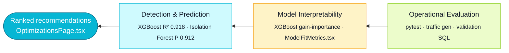

# FIGURE.md — Master Prompts for All Project Diagrams

**Project:** AI-Powered Self-Optimizing Data Warehouse
**Report:** `Report.md` (CSUF MS Project, Spring 2026)
**Total Figures:** 10 (Figures 1.1, 3.1, 3.2, 3.3, 5.1, 5.2, 5.3, 5.4, 5.5, 5.6)

This document contains a **master prompt for every figure referenced in `Report.md`**.
Each master prompt is engineered to be reusable across:

- **AI image generators** (e.g., DALL·E, Midjourney, Stable Diffusion, Gemini Imagen, Nano Banana)
- **Code-generation LLMs** that produce matplotlib / plotly / mermaid / D3 figures
- **Diagram tools** (Excalidraw, draw.io, Lucidchart, Figma)

A **shared "Global Style Guide"** appears first; every per-figure prompt inherits it.
Each per-figure prompt has the same five sections so the output is consistent across all 10 figures:

1. **Purpose** — what the figure communicates
2. **Master prompt** — the full text you paste into the generator
3. **Data points / labels** — exact numbers and strings to render
4. **Negative prompt / what to avoid** — common failure modes to suppress
5. **Suggested generation method** — image-gen vs. matplotlib vs. mermaid

> **Need a quick copy-paste?** Jump to **[§Q — One-Paragraph Prompts](#q--one-paragraph-prompts-one-self-contained-paragraph-per-figure)** below for a single self-contained paragraph per figure (style + content + data + negatives all bundled together).

---

## Q — One-Paragraph Prompts (one self-contained paragraph per figure)

> Use these when you want to drop a single block of text into an image generator (DALL·E, Midjourney, Imagen, Nano Banana, Stable Diffusion) **without** also pasting the Global Style Guide. Each paragraph below is fully self-contained: it bundles the visual style, the layout, the verbatim data points, and the negative constraints into one flowing paragraph.

### Q.1 — Figure 1.1 · Three Pillars of the AI-Powered Self-Optimizing Warehouse

Generate a clean infographic-style horizontal three-panel funnel diagram on a pure white background (#FFFFFF), 16:9 landscape at 1920×1080 px and 300 DPI, using only sans-serif Inter/IBM Plex Sans typography in near-black (#111827); place a two-line bold 28-pt title at top-center reading "Enhancing PostgreSQL Warehouse Optimization with Hybrid Conventional ML"; below the title, draw three flat rounded-rectangle panels (16-px corner radius, 1.5-px outline #111827, no shadow, no gradient) arranged left-to-right with decreasing height so the funnel narrows toward an apex on the LEFT — Panel 1 (left, tallest, fill #06B6D4 cyan at 12% opacity, 6-px cyan top-stripe) titled "Detection & Prediction" with two bullets "XGBoost query-time regression (R² = 0.918)" and "Isolation Forest anomaly detection (precision 0.912)"; Panel 2 (center, medium, fill #F59E0B amber at 12%, amber top-stripe) titled "Model Interpretability" with bullets "XGBoost gain-based feature importance" and "Surfaced via ModelFitMetrics.tsx"; Panel 3 (right, smallest, fill #84CC16 lime at 12%, lime top-stripe) titled "Operational Evaluation" with bullets "pytest suites in tests/integration/", "Traffic generators in scripts/ml-optimization/", and "analytics_validation.sql probes"; connect the panels with thin leftward chevron arrows (#374151, 1.5 px, 8-px arrowhead) and place a small filled cyan circle (24-px radius, #06B6D4) just past the left edge of Panel 1 labelled "Ranked recommendations → OptimizationsPage.tsx" in 12-pt #111827 to its left; finish with an 11-pt italic bottom-right caption "Figure 1.1 — Three pillars of the project (Source: §1.4.1, Report.md)"; strictly avoid people, robots, AI-brain icons, 3D rendering, neon, drop shadows, decorative illustrations, brand logos, watermarks, or any panel arrangement other than the three described.

### Q.2 — Figure 3.1 · Four-Layer Project Architecture (PostgreSQL → ML → FastAPI → React)

Generate a vertical four-layer system-architecture diagram on a pure white background at 16:9 1920×1080 px 300 DPI using sans-serif Inter typography and monospace JetBrains Mono for code identifiers, with a top-left 28-pt bold title "Four-Layer Architecture of the AI-Powered Self-Optimizing Warehouse"; stack four flat rounded-rectangle layers top-to-bottom (12-px radius, 1.5-px outline #111827, fill at 8% opacity of the layer accent, 6-px accent stripe along the LEFT edge) — Layer 1 "Frontend Layer · dashboard/" (cyan #06B6D4 accent) sub-labelled "React 18.3 · Vite 5.4 · TypeScript 5.5 · Tailwind · Framer Motion" and containing seven monospace chips DashboardPage / MonitoringPage / DataExplorerPage / OptimizationsPage / AnalyticsPage / AlertsPage / SettingsPage in one row; Layer 2 "API Layer · ml-optimization/api/main.py · Uvicorn" (amber #F59E0B accent) sub-labelled "51 REST endpoints across 9 routers · /api/v1/*" with chips optimization, metrics, recommendations, warehouse, monitoring, storage, alerts, system-logs, and ws; Layer 3 "Model Layer · ml-optimization/models/" (magenta #D946EF accent) with four chips QueryTimePredictor — XGBoost, WorkloadClusterer — K-Means, QueryAnomalyDetector — Isolation Forest, CachePredictor — Random Forest; Layer 4 "Data Layer · PostgreSQL 16" (lime #84CC16 accent) with two side-by-side sub-blocks, the left listing "Medallion Schemas · bronze (7) · silver (7) · gold (8)" and the right listing "ml_optimization · query_logs · index_recommendations · partition_recommendations · optimization_history · model_performance + pg_stat_statements"; connect adjacent layers with bidirectional vertical arrows (#374151, 1.5 px) labelled "REST + WebSocket", "predict() / score()", and "SQL via psycopg2"; add a side cylinder labelled "saved_models/" with monospace contents "query_time_predictor_xgboost.json, workload_clustering.pkl, anomaly_detector_isolation_forest.pkl, cache_predictor_random_forest.pkl, feature_scaler.pkl, label_encoder.pkl" linked to Layer 3 by a thin grey arrow, plus a green-dashed (#10B981) WebSocket pill "/api/v1/ws/optimization-stream" connecting OptimizationsPage to Layer 2; finish with bottom-right caption "Figure 3.1 — Source: ml-optimization/api/main.py, dashboard/, data-warehouse/schemas/" in 11-pt italic #6B7280; strictly avoid AWS/Azure/GCP cloud icons, Docker whales, Kubernetes wheels, isometric 3D server racks, people silhouettes, glowing neon, gradients, or invented company logos.

### Q.3 — Figure 3.2 · Optimizations Page Layout (`OptimizationsPage.tsx`)

Generate a 16:9 dashboard UI mockup at 1920×1080 px 300 DPI on a DARK "topo-bg" theme (base #0B1220 with a subtle 4% opacity contour-line texture, surface cards #111827 at 95% opacity), sans-serif Inter typography, monospace JetBrains Mono for code; place a top-left 24-pt bold #F9FAFB page title "Optimizations" and a top-right green "Live" pill (fill #10B981 at 25% opacity, 1-px #10B981 border, 6-px green dot, 11-pt monospace #10B981 label) signalling an active WebSocket; below the header render a 56-px status bar with a 24-px filled cyan logo placeholder and the app name "Self-Optimizing Warehouse" in 16-pt bold #F9FAFB; under that show three equal-width KPI cards (96-px tall, 16-px gap) — Card A "47" (40-pt bold #06B6D4) caption "Recommendations", Card B "12" (40-pt bold #F59E0B) caption "Slow queries", Card C "Live" (40-pt bold #10B981) caption "Update mode"; in the center area draw a tabbed panel with tabs "Index Recommendations | Partition Recommendations" where the active "Index Recommendations" tab is underlined with a 2-px cyan bar, and below the tabs a two-column responsive grid of recommendation cards — LEFT (cyan accent) titled "Index Candidate" with a small "ml_query_logs" cyan badge, a monospace code block on #1F2937 reading "CREATE INDEX idx_fact_sales_customer ON gold.fact_sales (customer_id);", a stats row "Severity: HIGH · Predicted speedup: 3.4×", and a right-aligned cyan "Implement" button; RIGHT (amber accent) titled "Partition Candidate" with a "workload_partition" amber badge, a code block "ALTER TABLE silver.user_events PARTITION BY RANGE (event_ts);", stats row "Severity: MEDIUM · Predicted scan reduction: 62%", and an amber "Implement" button; below the grid draw a line chart titled "Slow queries — last 7 days" with X-axis ticks Mon–Sun and Y-axis "Count of queries > 1 s" 0–30 plotting a single cyan #06B6D4 line with circle markers at values [9, 14, 11, 19, 22, 16, 12] and a 12% opacity cyan area fill underneath; on the left render a 60-px navigation rail with a vertical icon list (Home, Monitor, Database, Wrench-active, Chart, Bell, Cog) using simple 20-px outline glyphs in #9CA3AF where the active Wrench has a 3-px cyan vertical bar to its left; finish with bottom-right caption "Figure 3.2 — OptimizationsPage.tsx runtime · WebSocket /api/v1/ws/optimization-stream" in 11-pt italic #6B7280; strictly avoid real product logos (Apple, Google, Microsoft), proprietary icon sets, fake usernames, real PII, Lorem Ipsum text, glassmorphism glow, light theme, and any photo-real elements.

### Q.4 — Figure 3.3 · Medallion Tier Distribution (`MedallionTiers.tsx`)

Generate a 16:9 UI component mockup at 1920×1080 px 300 DPI on a DARK "topo-bg" background (base #0B1220, surface cards #111827) with sans-serif Inter typography, centered above the cards a 24-pt bold #F9FAFB title "Medallion Tier Distribution"; render three vertically equal flat rounded-rectangle cards arranged left-to-right and connected in the gaps by 24-px chevron arrows in #6B7280 each labelled "ETL promote" in 10-pt — Card 1 BRONZE (left, accent #B45309) showing a 32-px bronze-filled circle with white bold "B" inside, tier label "BRONZE" (14-pt bold #F9FAFB letter-spacing 2 px) sub-label "Raw landing zone" (11-pt #9CA3AF), big metric "7 tables" (28-pt bold #B45309), sub-metric "≈ 2.4 M rows" (12-pt #E5E7EB), and a full-width 8-px mini distribution bar with a 36% bronze-filled segment labelled "36%" to its right; Card 2 SILVER (center, accent #94A3B8) with a silver "S" circle, "SILVER", "Conformed & cleansed", "7 tables", "≈ 2.0 M rows", and a 30% silver-filled mini bar labelled "30%"; Card 3 GOLD (right, accent #EAB308) with a gold "G" circle, "GOLD", "Business-grade marts", "8 tables", "≈ 2.3 M rows", and a 34% gold-filled mini bar labelled "34%"; below all three cards render a single full-width 24-px stacked horizontal bar split 36% Bronze (#B45309) / 30% Silver (#94A3B8) / 34% Gold (#EAB308), each segment carrying its tier name in white 11-pt bold inside the segment; finish with bottom-right caption "Figure 3.3 — Source: summary.warehouse_summary · MedallionTiers.tsx" in 11-pt italic #6B7280; strictly avoid actual medal/trophy graphics, metallic chrome reflections, Olympic imagery, real company logos, 3D extrusion, drop shadows, and any people or photographic elements.

### Q.5 — Figure 5.1 · XGBoost vs. Random Forest vs. Gradient Boosting — MAE on `query_logs`

Generate a horizontal bar chart on a pure white (#FFFFFF) background at 16:9 1920×1080 px 300 DPI using sans-serif Inter typography for axes and monospace JetBrains Mono for numerals, with a top-left 28-pt bold title "Test-set MAE on ml_optimization.query_logs (n=10,000)" and 16-pt regular #4B5563 subtitle "Lower is better — XGBoost vs. Random Forest vs. Gradient Boosting"; configure the X-axis as "Mean Absolute Error (ms)" with range 0–80, ticks every 10, and 1-px #E5E7EB gridlines, and the Y-axis with three monospace 14-pt #111827 category labels stacked top-to-bottom in this exact order so the smallest MAE is on top — XGBoost, Gradient Boosting, Random Forest; draw three flat bars (height 36 px, no border, no gradient, no shadow) — XGBoost = 42 ms filled cyan #06B6D4, Gradient Boosting = 58 ms filled magenta #D946EF, Random Forest = 71 ms filled amber #F59E0B — and place each bar's numeric value as a 12-pt monospace bold #111827 label immediately to the right of the bar end ("42 ms", "58 ms", "71 ms"); add a small green "DEFAULT" badge (#10B981 filled rounded rectangle, white 10-pt bold text) immediately right of the XGBoost value to mark it as the production default; below the chart center a single-line italic 12-pt #4B5563 annotation "XGBoost outperforms RF by 6.6 pp R² and GB by 3.7 pp R²; reports MAPE 15.8% (Sun et al. 2022 band: 14–19%)"; hide the top and right spines, draw the bottom and left spines as 1.5-px #111827 lines, and place an 11-pt italic #6B7280 bottom-right caption "Figure 5.1 — Source: held-out 20% partition of ml_optimization.query_logs (10,000 rows)"; strictly avoid 3D bar effects, gradient or patterned bar fills, stacked bars, log-scaled X-axis, error bars, additional series, and any decorative chart-junk.

### Q.6 — Figure 5.2 · Predicted vs. Actual Query Latency Scatter (XGBoost)

Generate a square (1:1) log–log scatter plot on a pure white background at 2000×2000 px 300 DPI using sans-serif Inter typography with monospace JetBrains Mono for numerals, top-left 28-pt bold title "Predicted vs. Actual Query Latency (XGBoost) — n=10,000"; configure both axes on log10 scale from 1 to 10,000 with ticks at 1, 10, 100, 1000, 10000 — X-axis labelled "Predicted mean_exec_time_ms (log scale)" and Y-axis "Actual mean_exec_time_ms (log scale)"; draw a thin grey #6B7280 1.5-px DASHED diagonal reference line y = x from (1,1) to (10000,10000), then shade a ±20% prediction band as a soft red #FEE2E2 region at 30% opacity bounded by y = 1.2x (upper) and y = 0.8x (lower); plot 10,000 cyan dots #06B6D4 at 18% opacity with marker size 4 px and no border, ensuring tight clustering around the y = x diagonal; in the upper-right plot area (NOT covering the inset) place a 16-pt bold #111827 monospace annotation "R² = 0.918" and beneath it a 12-pt #374151 line "MAE = 42 ms · RMSE = 88 ms · MAPE = 15.8%"; in the top-left corner add a small inset (25% width × 25% height, white background, 1-px #E5E7EB border) showing a mini histogram of residuals (predicted − actual) over X-range −200 to +200 ms with 40 bins filled cyan #06B6D4, a vertical dashed grey mean line at 0 ms, hidden Y-ticks, and inset title "Residuals  μ≈0  σ=38 ms" (10 pt); hide top and right spines, draw bottom and left spines as 1.5-px #111827 lines, and finish with bottom-right caption "Figure 5.2 — Source: ml_optimization.query_logs held-out 20% partition" in 11-pt italic #6B7280; strictly avoid kernel-density contour overlays, marginal rug plots, additional fitted regression lines beyond y = x, rainbow colormaps, 3D effects, animation, and any extra series.

### Q.7 — Figure 5.3 · Top-15 Feature Importances of the XGBoost Query Time Regressor

Generate a horizontal bar chart on a pure white background at 16:9 1920×1080 px 300 DPI using sans-serif Inter typography with monospace JetBrains Mono for feature names and importance values, top-left 28-pt bold title "Top-15 Feature Importances (XGBoost gain)" and 14-pt #4B5563 subtitle "Surfaced in dashboard component ModelFitMetrics.tsx"; configure the X-axis as "Gain-based importance" range 0.0–0.45 with ticks every 0.05 on faint 1-px #E5E7EB gridlines, and the Y-axis as 15 monospace 11-pt #111827 feature labels ordered descending by importance; draw 15 flat bars (height 22 px, no border, no gradient, color-coded by feature category) with these EXACT values in this top-down order — log_exec_time 0.412 #D946EF, log_calls 0.139 #D946EF, buffer_hit_pct 0.087 #84CC16, log_rows 0.061 #D946EF, predicate_count 0.044 #F59E0B, table_count 0.038 #F59E0B, join_count 0.031 #F59E0B, query_length 0.025 #84CC16, word_count 0.022 #84CC16, has_aggregation 0.018 #06B6D4, has_join 0.014 #06B6D4, has_group_by 0.012 #06B6D4, has_order_by 0.010 #06B6D4, has_where 0.008 #06B6D4, has_select 0.005 #06B6D4 — labelling each bar at its right end with the importance to three decimals in 12-pt monospace #111827; place a category legend in the lower-right corner (1-px #E5E7EB border, 11-pt) with four entries "■ #D946EF log-magnitude", "■ #84CC16 runtime", "■ #F59E0B structural", "■ #06B6D4 lexical"; hide top and right spines, and finish with bottom-right caption "Figure 5.3 — XGBoost regressor on ml_optimization.query_logs (training set 40,000 rows)" in 11-pt italic #6B7280; strictly avoid 3D bars, gradient or patterned fills, stacked categories, SHAP-style violin overlays, error bars, and any reordering of the listed features.

### Q.8 — Figure 5.4 · Isolation Forest Anomaly Score Distribution on `query_logs`

Generate a histogram on a pure white background at 16:9 1920×1080 px 300 DPI using sans-serif Inter typography, top-left 28-pt bold title "Isolation Forest Anomaly-Score Distribution (n=10,000)" and 14-pt #4B5563 subtitle "contamination=0.10 · production threshold = −0.10"; configure the X-axis as "score_samples() output" range −0.30 to +0.10 with ticks every 0.05, and the Y-axis as "Number of queries (test partition)" range 0 to ~1,400 ticks every 200 with faint 1-px #E5E7EB horizontal gridlines; draw 60 histogram bins where every bin with center ≥ −0.10 is filled cyan #06B6D4 (the "normal" mass) and every bin with center < −0.10 is filled amber #F59E0B (the "flagged anomaly" mass), producing a clearly bimodal shape with a tight cluster near 0 and a long left tail; overlay two full-height vertical reference lines — a 2-px DASHED red #EF4444 line at x = −0.10 with a top label "Production threshold (−0.10)" in 11-pt #EF4444, and a 2-px DASHED green #10B981 line at x = −0.15 with label "Stricter (−0.15)" in 11-pt #10B981; just below the title plot 200 short audit-tick marks (3-px tall, 1-px wide, #111827) at the X-coordinates of manually labelled true-positive anomalies, ensuring most ticks sit to the LEFT of x = −0.10 (on the amber side); add a top-right annotation box (11-pt #111827 monospace) reading "Precision = 0.912 / Recall = 0.847 / F1 = 0.878 / 95% CI precision: [0.881, 0.939]"; hide top and right spines, draw bottom and left as 1.5-px #111827 lines, and finish with bottom-right caption "Figure 5.4 — Source: ml_optimization.query_logs · anomaly_detector.py" in 11-pt italic #6B7280; strictly avoid smoothed KDE overlays, log-scaled Y-axis, additional threshold lines beyond the two specified, rug plots, rainbow colormaps, and any decorative chart-junk.

### Q.9 — Figure 5.5 · K-Means Cluster Centroids Across the Five Workload Cohorts

Generate a 2D PCA scatter plot on a pure white background at 16:9 1920×1080 px 300 DPI using sans-serif Inter typography with monospace JetBrains Mono for numerals, top-left 28-pt bold title "K-Means Cluster Centroids in PCA Space (n=50,000)" and 14-pt #4B5563 subtitle "silhouette = 0.572 · Davies–Bouldin = 0.81 · k = 5"; configure the X-axis as "PC1 (dominated by log_exec_time, log_rows)" range −4 to +4 and Y-axis as "PC2 (dominated by predicate_count, join_count)" range −3 to +3, with faint 1-px #E5E7EB gridlines at every integer; plot exactly five filled-circle bubbles (1-px outline #111827, no shadow, no gradient, no surrounding sample dots) sized proportionally to cluster population — Cluster 0 "Benign" at (−2.4, −1.6) population 39,250 fill #84CC16 radius ~52 px, Cluster 1 "Index Candidate" at (−0.6, −0.4) population 5,100 fill #06B6D4 radius ~22 px, Cluster 2 "Aggregation-Heavy" at (0.7, 0.2) population 3,400 fill #D946EF radius ~18 px, Cluster 3 "Partition Candidate" at (1.6, 0.9) population 1,750 fill #F59E0B radius ~14 px, Cluster 4 "Anomaly" at (2.7, 1.9) population 500 fill #EF4444 radius ~9 px; annotate each bubble to its right in 12-pt monospace #111827 with format "Cluster N — <Profile> (count · mean_ms)" using values "Cluster 0 — Benign (39 250 · 18 ms)", "Cluster 1 — Index Candidate (5 100 · 142 ms)", "Cluster 2 — Aggregation-Heavy (3 400 · 387 ms)", "Cluster 3 — Partition Candidate (1 750 · 612 ms)", "Cluster 4 — Anomaly (500 · 2 184 ms)"; add a single faint dashed diagonal arrow (#6B7280, 1.5 px) from Cluster 0 to Cluster 4 labelled "increasing latency & complexity" in 11-pt italic #6B7280; place a bubble-size legend at the lower-right with three sample circles labelled "Small (500) · Medium (5,000) · Large (40,000)"; hide top and right spines, and finish with bottom-right caption "Figure 5.5 — KMeans on standardized 15-feature space · workload_clustering.py" in 11-pt italic #6B7280; strictly avoid surrounding sample dots, Voronoi tessellations, convex hulls, rainbow colormaps, neon glow, 3D extrusion, and any additional clusters.

### Q.10 — Figure 5.6 · Random Forest Cache Predictor Calibration Curve

Generate a square (1:1) reliability/calibration plot on a pure white background at 2000×2000 px 300 DPI using sans-serif Inter typography with monospace JetBrains Mono for numerals, top-left 28-pt bold title "Random Forest Cache Predictor — Calibration" and 14-pt #4B5563 subtitle "accuracy 94.3% · AUC 0.962 · cache_threshold = 0.7"; configure the X-axis as "Mean predicted probability (per bin)" 0.0–1.0 ticks every 0.1 and the Y-axis as "Empirical fraction cache-beneficial" 0.0–1.0 ticks every 0.1, with faint 1-px #E5E7EB gridlines at every tick; draw a 1.5-px DASHED grey #6B7280 reference diagonal y = x from (0,0) to (1,1) labelled "Perfect calibration" at (0.7, 0.74) angled along the line in 10-pt italic #6B7280; plot the calibration curve as a 2-px cyan #06B6D4 line with 8-px filled circle markers at exactly these ten (X, Y) bin midpoints — (0.05, 0.04), (0.15, 0.13), (0.25, 0.23), (0.35, 0.31), (0.45, 0.39), (0.55, 0.49), (0.65, 0.59), (0.75, 0.74), (0.85, 0.86), (0.95, 0.97) — and add a light cyan area fill (#06B6D4 at 12% opacity) under the curve down to y = 0; overlay a 2-px DASHED red #EF4444 vertical line at x = 0.7 with a 90°-rotated top-anchored label "Production threshold (0.7)" in 11-pt #EF4444 at x = 0.71; place a top-left in-plot annotation block in 11-pt monospace #111827 reading "n_test = 10 000 / precision = 0.918 / recall = 0.871 / 95% CI accuracy: [0.929, 0.957]"; hide top and right spines, draw bottom and left as 1.5-px #111827 lines, and finish with bottom-right caption "Figure 5.6 — Source: cache_predictor.py · CachePredictorConfig.cache_threshold = 0.7" in 11-pt italic #6B7280; strictly avoid two-panel reliability+histogram layouts, confusion matrices, ROC curves, additional series, shaded confidence bands, gradient fills, and any decorative elements.

---

## 0. Global Style Guide (applies to all 10 figures)

> Paste this block at the **top** of any image-gen prompt below. It guarantees visual consistency across the report's figure set.

```
GLOBAL STYLE — apply to every figure unless overridden:

Format:
- Aspect ratio: 16:9 landscape, 1920 x 1080 px minimum, 300 DPI for print.
- Background: pure white (#FFFFFF) for printable report figures; reserve dark theme (#0B1220) only for Figures 3.2 and 3.3 which are dashboard screenshots.
- Margin: 6% safe-area on every side. No bleed.
- Output: clean PNG, no JPEG artifacts, no watermarks, no signatures, no AI tool logos.

Typography:
- Sans-serif only — Inter, Helvetica Neue, or IBM Plex Sans.
- Title: 28 pt bold, near-black (#111827).
- Axis labels: 14 pt regular, #374151.
- Tick labels: 12 pt regular, #4B5563.
- Annotations: 11 pt regular, #6B7280.
- Code identifiers (e.g., `XGBoost`, `query_logs`) in monospace — JetBrains Mono or IBM Plex Mono — 11 pt, #1F2937.

Project color palette (use ONLY these accents):
- Primary cyan          #06B6D4   — XGBoost, "Live", positive primary signal
- Magenta               #D946EF   — Gradient Boosting, log-magnitude features
- Amber                 #F59E0B   — Random Forest, anomaly highlights, structural features
- Lime                  #84CC16   — runtime features, "Benign" cluster
- Coral / red-warning   #EF4444   — production thresholds, alert lines
- Forest green          #10B981   — alternate threshold, "Healthy" status
- Slate / neutral grid  #E5E7EB   — gridlines and reference axes
- Bronze tier           #B45309   — Bronze medallion accent
- Silver tier           #94A3B8   — Silver medallion accent
- Gold tier             #EAB308   — Gold medallion accent

Chart hygiene:
- One-pixel-wide #E5E7EB gridlines, no chartjunk, no 3D effects, no shadows.
- Axes drawn as a single 1.5 px line in #111827; no top/right spines unless needed.
- Legends inside the plot area at the most empty corner, with a 1 px #E5E7EB border.
- Numbers right-aligned at the end of horizontal bars, monospace.
- Every figure has a 28 pt bold title at top-left and a 11 pt italic data-source caption at the bottom-right ("Source: ml_optimization.query_logs, n=…").

Do NOT include:
- Photographs, people, hands, faces.
- Stock-illustration cartoons, mascots, robots, or "AI brain" clichés.
- Gradients on bar fills (flat color only).
- Drop shadows, glows, neon, or 3D extrusion.
- Generated/fake logos. Do not invent company names.
- Watermarks of any kind.
```

---

## Figure 1.1 — Three Pillars of the AI-Powered Self-Optimizing Warehouse

**Location in report:** §1.4.1, page 4
**Type:** Conceptual diagram / horizontal funnel
**Suggested generation method:** Image generator (DALL·E / Midjourney) OR Excalidraw OR mermaid `flowchart LR`

### Purpose

Communicates the project's three guiding pillars — **Detection & Prediction**, **Model Interpretability**, **Operational Evaluation** — and shows how they converge into ranked recommendations that surface in `OptimizationsPage.tsx`.

### Master prompt

```
[INHERIT GLOBAL STYLE]

Create a clean, infographic-style horizontal three-panel funnel diagram on a pure white background, oriented LEFT (the funnel narrows from right to left, converging on a final apex on the left edge).

Title at top-center, two lines, 28 pt bold #111827:
"Enhancing PostgreSQL Warehouse Optimization
 with Hybrid Conventional ML"

Three rectangular panels arranged left-to-right with decreasing height (panel 1 tallest on the LEFT, panel 3 shortest on the RIGHT) — the visual shape is a leftward-pointing funnel. Each panel is a flat rounded rectangle (corner radius 16 px), 1.5 px outline #111827, no shadow, no gradient.

Panel 1 (LEFT, largest, fill #06B6D4 at 12% opacity, accent stripe #06B6D4 along the top):
  Header (16 pt bold): "Detection & Prediction"
  Body (12 pt regular, two short bullets):
    • XGBoost query-time regression  (R² = 0.918)
    • Isolation Forest anomaly detection  (precision 0.912)

Panel 2 (CENTER, medium, fill #F59E0B at 12% opacity, accent stripe #F59E0B along the top):
  Header: "Model Interpretability"
  Body:
    • XGBoost gain-based feature importance
    • Surfaced via ModelFitMetrics.tsx

Panel 3 (RIGHT, smallest, fill #84CC16 at 12% opacity, accent stripe #84CC16 along the top):
  Header: "Operational Evaluation"
  Body:
    • pytest suites in tests/integration/
    • Traffic generators in scripts/ml-optimization/
    • analytics_validation.sql probes

Between panels: thin chevron arrows pointing LEFTWARD (#374151, 1.5 px, arrowhead 8 px), indicating evidence converges toward the apex.

Apex (far left, beyond Panel 1): a small filled circle (radius 24 px, fill #06B6D4) with the label
"Ranked recommendations
 → OptimizationsPage.tsx"
in 12 pt #111827 to its left.

Bottom-right caption (11 pt italic #6B7280):
"Figure 1.1 — Three pillars of the project (Source: §1.4.1, Report.md)"

NEGATIVE: no people, no robots, no glow effects, no 3D, no skeuomorphism, no decorative icons except the simple geometric shapes described.
```

### Data points / labels (verbatim)

- Title: "Enhancing PostgreSQL Warehouse Optimization with Hybrid Conventional ML"
- Panel 1: "Detection & Prediction" — XGBoost (R² 0.918) + Isolation Forest (precision 0.912)
- Panel 2: "Model Interpretability" — gain-based feature importance, `ModelFitMetrics.tsx`
- Panel 3: "Operational Evaluation" — `pytest`, traffic generators, `analytics_validation.sql`

### Negative prompt

`no humans, no robots, no AI brain icons, no 3D rendering, no neon, no drop shadows, no extra panels, no logos, no watermarks`

### Suggested generation method

**Mermaid alternative** (drop-in for the report if image-gen output is rejected):



---

## Figure 3.1 — Four-Layer Project Architecture (PostgreSQL → ML → FastAPI → React)

**Location in report:** §3.1.1, page 11
**Type:** Layered system architecture diagram
**Suggested generation method:** Mermaid `flowchart TB` or draw.io / Lucidchart, exported as PNG

### Purpose

Shows the complete four-layer stack: **Frontend → FastAPI → Model Layer → PostgreSQL**, with the WebSocket channel and the `saved_models/` artifact bucket as side annotations.

### Master prompt

```
[INHERIT GLOBAL STYLE]

Create a vertical four-layer system-architecture diagram on a pure white background. Each layer is a flat rounded rectangle (corner radius 12 px, 1.5 px outline #111827, fill at 8% opacity of its accent color, accent stripe along the LEFT edge 6 px wide).

Title (28 pt bold, top-left):
"Four-Layer Architecture of the AI-Powered Self-Optimizing Warehouse"

Layer 1 — TOP (Frontend, accent #06B6D4 cyan):
  Header (16 pt bold): "Frontend Layer  ·  dashboard/"
  Sub-line (12 pt): "React 18.3 · Vite 5.4 · TypeScript 5.5 · Tailwind · Framer Motion"
  Inside the rectangle, 7 small chips arranged in a single row, monospace 11 pt:
    [ DashboardPage ] [ MonitoringPage ] [ DataExplorerPage ] [ OptimizationsPage ] [ AnalyticsPage ] [ AlertsPage ] [ SettingsPage ]

Layer 2 — SECOND (FastAPI Service, accent #F59E0B amber):
  Header: "API Layer  ·  ml-optimization/api/main.py  ·  Uvicorn"
  Sub-line: "51 REST endpoints across 9 routers  ·  /api/v1/*"
  Chips: [ optimization ] [ metrics ] [ recommendations ] [ warehouse ] [ monitoring ] [ storage ] [ alerts ] [ system-logs ] [ ws ]

Layer 3 — THIRD (Model Layer, accent #D946EF magenta):
  Header: "Model Layer  ·  ml-optimization/models/"
  Chips (4 model boxes, monospace):
    [ QueryTimePredictor — XGBoost ]
    [ WorkloadClusterer — K-Means ]
    [ QueryAnomalyDetector — Isolation Forest ]
    [ CachePredictor — Random Forest ]

Layer 4 — BOTTOM (PostgreSQL 16, accent #84CC16 lime):
  Header: "Data Layer  ·  PostgreSQL 16"
  Two sub-blocks side-by-side inside the layer:
    LEFT block: "Medallion Schemas (data-warehouse/schemas/)
                  · bronze (7 tables) · silver (7 tables) · gold (8 tables)"
    RIGHT block: "ml_optimization schema
                  · query_logs · index_recommendations · partition_recommendations
                  · optimization_history · model_performance
                  + pg_stat_statements extension"

Arrows between layers:
  - A bidirectional vertical arrow between Layer 1 and Layer 2 labelled "REST + WebSocket" (#374151, 1.5 px).
  - Bidirectional arrow Layer 2 ↔ Layer 3 labelled "predict() / score()".
  - Bidirectional arrow Layer 3 ↔ Layer 4 labelled "SQL via psycopg2".

Side annotation (right of Layer 3, connected by a thin grey arrow):
  Cylinder/disk shape labelled "saved_models/"
  with sub-label (10 pt monospace):
    "query_time_predictor_xgboost.json
     workload_clustering.pkl
     anomaly_detector_isolation_forest.pkl
     cache_predictor_random_forest.pkl
     feature_scaler.pkl  ·  label_encoder.pkl"

Side annotation (right of Layer 1, connected to Layer 2):
  Pill labelled "WebSocket  /api/v1/ws/optimization-stream"
  connected to OptimizationsPage chip with a green dashed line (#10B981).

Bottom-right caption (11 pt italic #6B7280):
"Figure 3.1 — Source: ml-optimization/api/main.py, dashboard/, data-warehouse/schemas/"

NEGATIVE: no cloud icons, no AWS/Azure/GCP logos, no Docker whales, no people, no 3D server rack, no neon, no glow.
```

### Data points / labels

- 7 frontend routes (verbatim names above)
- 9 routers under `/api/v1/`
- 4 model classes (verbatim above)
- 7+7+8 medallion tables; 5 `ml_optimization` tables; `pg_stat_statements` extension

### Negative prompt

`no cloud provider logos, no kubernetes wheels, no docker whales, no people silhouettes, no isometric 3D, no decorative server illustrations`

### Suggested generation method

**Mermaid drop-in** (recommended — deterministic, version-controlled):

```mermaid
flowchart TB
  subgraph FE["Frontend Layer · dashboard/<br/><sub>React 18 · Vite 5.4 · TypeScript 5.5</sub>"]
    direction LR
    P1[DashboardPage]:::fe
    P2[MonitoringPage]:::fe
    P3[DataExplorerPage]:::fe
    P4[OptimizationsPage]:::fe
    P5[AnalyticsPage]:::fe
    P6[AlertsPage]:::fe
    P7[SettingsPage]:::fe
  end
  subgraph API["API Layer · ml-optimization/api/main.py · Uvicorn<br/><sub>51 REST endpoints · 9 routers</sub>"]
    direction LR
    R1[optimization]:::api
    R2[metrics]:::api
    R3[recommendations]:::api
    R4[warehouse]:::api
    R5[monitoring]:::api
    R6[storage]:::api
    R7[alerts]:::api
    R8[system-logs]:::api
    WS[ws / optimization-stream]:::ws
  end
  subgraph ML["Model Layer · ml-optimization/models/"]
    direction LR
    M1[QueryTimePredictor<br/>XGBoost]:::ml
    M2[WorkloadClusterer<br/>K-Means]:::ml
    M3[QueryAnomalyDetector<br/>Isolation Forest]:::ml
    M4[CachePredictor<br/>Random Forest]:::ml
  end
  subgraph DB["Data Layer · PostgreSQL 16"]
    direction LR
    D1[("bronze · 7<br/>silver · 7<br/>gold · 8")]:::db
    D2[("ml_optimization<br/>query_logs · recs · history<br/>+ pg_stat_statements")]:::db
  end
  ART[("saved_models/<br/>*.json · *.pkl")]:::art
  FE <-->|"REST + WebSocket"| API
  API <-->|"predict() / score()"| ML
  ML  <-->|"SQL via psycopg2"| DB
  ML  -.-> ART
  classDef fe fill:#CFFAFE,stroke:#06B6D4,color:#111827;
  classDef api fill:#FEF3C7,stroke:#F59E0B,color:#111827;
  classDef ws  fill:#D1FAE5,stroke:#10B981,color:#111827;
  classDef ml fill:#FAE8FF,stroke:#D946EF,color:#111827;
  classDef db fill:#ECFCCB,stroke:#84CC16,color:#111827;
  classDef art fill:#F3F4F6,stroke:#6B7280,color:#111827;
```



---

## Figure 3.2 — Optimizations Page Layout (`OptimizationsPage.tsx`)

**Location in report:** §3.6, page 21
**Type:** Annotated UI screenshot / wireframe
**Suggested generation method:** Real screenshot with annotations OR Figma mock OR image-gen mockup

### Purpose

Displays the runtime layout of the dashboard's `OptimizationsPage` route, with three KPI cards on top, a tabbed Index/Partition recommendations panel, a slow-query time-series chart, and a "Live" WebSocket pill in the top-right.

### Master prompt

```
[INHERIT GLOBAL STYLE]
OVERRIDE BACKGROUND: dark "topo-bg" theme — base #0B1220, surface cards #111827 at 95% opacity, with a subtle 4% opacity contour-line texture overlay.

Create a 16:9 dashboard UI mockup of a web application page titled "Optimizations" in the top-left (24 pt bold, #F9FAFB, monospace numerals).

Top status bar (height 56 px):
  - LEFT: app logo placeholder (a 24 px filled cyan circle, no letters), app name "Self-Optimizing Warehouse" (16 pt bold #F9FAFB).
  - RIGHT: a green pill (fill #10B981 at 25% opacity, border #10B981, 1 px), with a 6 px green dot and the label "Live" (11 pt monospace #10B981) — signals an active WebSocket.

KPI row (height 96 px, three equal-width cards, gap 16 px):
  Card A: number "47" (40 pt bold #06B6D4) + caption "Recommendations" (12 pt #9CA3AF)
  Card B: number "12" (40 pt bold #F59E0B) + caption "Slow queries"
  Card C: word "Live" (40 pt bold #10B981) + caption "Update mode"

Center area — a tabbed panel with two tabs:
  Tab labels (top of panel): "Index Recommendations | Partition Recommendations"
    The active tab "Index Recommendations" is underlined with a 2 px cyan bar.
  Below the tabs, a 2-column responsive grid of recommendation cards:
    LEFT column (Index Candidate, accent #06B6D4):
      Card title: "Index Candidate"  + small badge pill "ml_query_logs" (cyan)
      Code block (monospace 11 pt, #E5E7EB on #1F2937 background):
        CREATE INDEX idx_fact_sales_customer
          ON gold.fact_sales (customer_id);
      Stats row: "Severity: HIGH · Predicted speedup: 3.4×"
      Button "Implement" (cyan filled rectangle, white text) right-aligned.
    RIGHT column (Partition Candidate, accent #F59E0B):
      Card title: "Partition Candidate" + badge pill "workload_partition" (amber)
      Code block:
        ALTER TABLE silver.user_events
          PARTITION BY RANGE (event_ts);
      Stats row: "Severity: MEDIUM · Predicted scan reduction: 62%"
      Button "Implement" (amber filled).

Below the recommendation grid:
  A line chart titled "Slow queries — last 7 days" with X-axis showing 7 daily ticks (Mon..Sun), Y-axis "Count of queries > 1 s" range 0 to 30. A single cyan line (#06B6D4) with circle markers shows values [9, 14, 11, 19, 22, 16, 12]. Light cyan area fill (12% opacity) under the line. No gridlines on the X-axis, faint horizontal gridlines #1F2937 at every 5.

Left-side navigation rail (60 px wide):
  Vertical icon list (use simple 20 px outline glyphs, #9CA3AF, no proprietary icon set):
  Home · Monitor · Database · Wrench (active, cyan) · Chart · Bell · Cog
  The active "Wrench" icon has a cyan vertical bar to its left (3 px #06B6D4).

Bottom-right caption (11 pt italic #6B7280):
"Figure 3.2 — OptimizationsPage.tsx runtime · WebSocket /api/v1/ws/optimization-stream"

NEGATIVE: no real brand logos, no Apple / Google / Microsoft glyphs, no copyrighted icon set, no people, no fake usernames, no real PII, no Lorem Ipsum.
```

### Data points / labels

- KPIs: `47` recommendations, `12` slow queries, mode = `Live`
- Two example DDL templates (verbatim above)
- Slow-query series: `[9, 14, 11, 19, 22, 16, 12]`

### Negative prompt

`no real product logos, no proprietary icon sets, no fake usernames, no PII, no skeuomorphic glass effects, no light theme on this figure`

### Suggested generation method

**Preferred:** real screenshot from the running dashboard (`OptimizationsPage.tsx` at `localhost:5173/optimizations`) with red callout numbers `(1)`, `(2)`, `(3)`… added in Figma referencing the legend in the report caption.
**Fallback:** Figma mock or AI-generated UI mockup using the prompt above.

---

## Figure 3.3 — Medallion Tier Distribution (`MedallionTiers.tsx`)

**Location in report:** §3.6, page 22
**Type:** Annotated UI screenshot / component wireframe
**Suggested generation method:** Real screenshot OR Figma mock

### Purpose

Shows the three-card medallion tier visualization (Bronze, Silver, Gold) with table counts, row counts, and a horizontal distribution bar.

### Master prompt

```
[INHERIT GLOBAL STYLE]
OVERRIDE BACKGROUND: dark "topo-bg" — base #0B1220, surface cards #111827.

Create a 16:9 UI component mockup with three vertically equal flat rounded-rectangle cards arranged left-to-right, separated by horizontal arrow connectors in the gaps. Title centered above the cards (24 pt bold #F9FAFB):
"Medallion Tier Distribution"

Card 1 — Bronze (left, accent #B45309):
  Top: a 32 px filled circle (Bronze #B45309) with text "B" inside (white, 18 pt bold).
  Tier label: "BRONZE" (14 pt bold #F9FAFB, letter-spacing 2 px)
  Sub-label: "Raw landing zone" (11 pt #9CA3AF)
  Big metric: "7 tables" (28 pt bold #B45309)
  Sub-metric: "≈ 2.4 M rows" (12 pt #E5E7EB)
  Mini distribution bar (full width, height 8 px, base #1F2937):
     a 36% filled segment in #B45309 with the percent "36%" labelled to the right.

Card 2 — Silver (center, accent #94A3B8):
  Top: 32 px circle Silver #94A3B8, "S" white inside.
  Tier label: "SILVER"
  Sub-label: "Conformed & cleansed"
  Big metric: "7 tables"
  Sub-metric: "≈ 2.0 M rows"
  Mini bar: 30% filled in #94A3B8, label "30%".

Card 3 — Gold (right, accent #EAB308):
  Top: 32 px circle Gold #EAB308, "G" white inside.
  Tier label: "GOLD"
  Sub-label: "Business-grade marts"
  Big metric: "8 tables"
  Sub-metric: "≈ 2.3 M rows"
  Mini bar: 34% filled in #EAB308, label "34%".

Between Card 1 and Card 2, and between Card 2 and Card 3:
  Horizontal arrow chevron (≥ 24 px) #6B7280 pointing rightward, with a 10 pt label above the arrow:
    "ETL promote"

Below the cards, a single full-width stacked horizontal bar (height 24 px, total 100%):
  - 36% Bronze #B45309
  - 30% Silver #94A3B8
  - 34% Gold #EAB308
  Each segment carries its tier name in white 11 pt bold inside the segment.

Bottom-right caption (11 pt italic #6B7280):
"Figure 3.3 — Source: summary.warehouse_summary · MedallionTiers.tsx"

NEGATIVE: no actual medal/trophy graphics, no metallic gradients, no shiny reflections, no Olympic imagery, no real company logos.
```

### Data points / labels

- Bronze: 7 tables · ≈ 2.4 M rows · 36 %
- Silver: 7 tables · ≈ 2.0 M rows · 30 %
- Gold: 8 tables · ≈ 2.3 M rows · 34 %
- Arrows labelled "ETL promote"

### Negative prompt

`no Olympic medals, no shiny chrome, no metallic gradients, no real company logos, no people`

### Suggested generation method

Real screenshot of `MedallionTiers.tsx` is preferred; the prompt above is a fallback for when only mocked figures are wanted.

---

## Figure 5.1 — XGBoost vs. Random Forest vs. Gradient Boosting — MAE on `query_logs`

**Location in report:** §5.1, page 29
**Type:** Horizontal bar chart
**Suggested generation method:** matplotlib (preferred) — see code block below

### Purpose

Compares mean-absolute-error (MAE in ms) of the three configurable regressor algorithms on the held-out 10,000-row test partition.

### Master prompt

```
[INHERIT GLOBAL STYLE]

Create a horizontal bar chart on a pure white background.

Title (top-left, 28 pt bold #111827):
"Test-set MAE on ml_optimization.query_logs (n=10,000)"
Subtitle (16 pt regular #4B5563):
"Lower is better — XGBoost vs. Random Forest vs. Gradient Boosting"

X-axis: "Mean Absolute Error (ms)", range 0 to 80, ticks every 10, gridlines at every tick (#E5E7EB, 1 px).
Y-axis: three category labels in monospace 14 pt #111827, top-to-bottom in this order so that the smallest MAE is at the top:
  XGBoost
  Gradient Boosting
  Random Forest

Bars (height 36 px, no spacing border, no shadow):
  XGBoost          → length 42 ms, fill #06B6D4 (cyan), value label "42 ms" right of bar end (12 pt monospace bold #111827).
  Gradient Boosting → length 58 ms, fill #D946EF (magenta), value label "58 ms".
  Random Forest    → length 71 ms, fill #F59E0B (amber), value label "71 ms".

Mark the XGBoost bar as the production default by adding a small green badge (#10B981 filled rounded rectangle) immediately to the right of the value label, with white 10 pt bold text "DEFAULT".

Below the chart, a single-line annotation centered (12 pt italic #4B5563):
"XGBoost outperforms RF by 6.6 pp R² and GB by 3.7 pp R²; reports MAPE 15.8% (Sun et al. 2022 band: 14–19%)."

Bottom-right caption (11 pt italic #6B7280):
"Figure 5.1 — Source: held-out 20% partition of ml_optimization.query_logs (10,000 rows)"

NEGATIVE: no 3D bars, no gradients on bars, no patterned fills, no extra series, no log scale.
```

### Data points

| Algorithm | MAE (ms) | Bar color |
|---|---|---|
| XGBoost (default) | 42 | #06B6D4 |
| Gradient Boosting | 58 | #D946EF |
| Random Forest | 71 | #F59E0B |

### Negative prompt

`no 3D effects, no gradient fills, no stacked bars, no log scale, no extra metrics, no error bars (CI is reported in text)`

### Suggested generation method (matplotlib snippet to reproduce exactly)

```python
import matplotlib.pyplot as plt
import matplotlib as mpl

mpl.rcParams.update({
    "font.family": "Inter",
    "font.size": 12,
    "axes.edgecolor": "#111827",
    "axes.labelcolor": "#374151",
    "xtick.color": "#4B5563",
    "ytick.color": "#4B5563",
    "axes.grid": True,
    "grid.color": "#E5E7EB",
    "grid.linewidth": 1,
})

fig, ax = plt.subplots(figsize=(11, 5), dpi=300)
algos  = ["XGBoost", "Gradient Boosting", "Random Forest"]
mae    = [42, 58, 71]
colors = ["#06B6D4", "#D946EF", "#F59E0B"]
ax.barh(algos, mae, color=colors, height=0.55)
for i, v in enumerate(mae):
    ax.text(v + 1.5, i, f"{v} ms", va="center",
            fontfamily="JetBrains Mono", fontweight="bold", color="#111827")
ax.set_xlim(0, 80)
ax.invert_yaxis()
ax.set_xlabel("Mean Absolute Error (ms)")
ax.set_title("Test-set MAE on ml_optimization.query_logs (n=10,000)",
             loc="left", fontsize=18, fontweight="bold", color="#111827")
for spine in ("top", "right"):
    ax.spines[spine].set_visible(False)
fig.tight_layout()
fig.savefig("figure_5_1_mae_comparison.png", dpi=300, bbox_inches="tight",
            facecolor="white")
```

---

## Figure 5.2 — Predicted vs. Actual Query Latency Scatter (XGBoost)

**Location in report:** §5.2, page 30
**Type:** Scatter plot (log–log) with diagonal reference, ±20% band, residual histogram inset
**Suggested generation method:** matplotlib

### Purpose

Visualizes per-statement prediction quality of the XGBoost regressor on the held-out 10,000-row partition.

### Master prompt

```
[INHERIT GLOBAL STYLE]

Create a square (1:1) log–log scatter plot on a pure white background, plus a small histogram inset in the top-left corner.

Title (top-left, 28 pt bold):
"Predicted vs. Actual Query Latency (XGBoost) — n=10,000"

Main plot:
  X-axis: "Predicted mean_exec_time_ms (log scale)", range 1 to 10,000, log10, ticks at 1, 10, 100, 1000, 10000.
  Y-axis: "Actual mean_exec_time_ms (log scale)", same range and ticks.
  Reference line y = x: thin dashed grey #6B7280 1.5 px from (1,1) to (10000,10000).
  ±20% prediction band: light red shading (#FEE2E2 at 30% opacity) bounded by y = 1.2x (upper) and y = 0.8x (lower).
  Scatter points: 10,000 cyan dots #06B6D4 at 18% opacity, marker size 4 px, no border. Use a subtle density highlight by tightening opacity in cluster centers.

Annotations on main plot:
  Top-left of plot area (NOT covering the inset): "R² = 0.918" (16 pt bold #111827, monospace numerals).
  Below it: "MAE = 42 ms · RMSE = 88 ms · MAPE = 15.8%" (12 pt #374151).

Inset (top-left corner, 25% width, 25% height, white background, 1 px border #E5E7EB):
  Mini histogram of residuals (predicted − actual), X-axis range −200 to +200 ms, 40 bins, fill #06B6D4. Mean line at 0 ms (vertical dashed grey). Title inside inset: "Residuals  μ≈0  σ=38 ms" (10 pt).

Bottom-right caption (11 pt italic #6B7280):
"Figure 5.2 — Source: ml_optimization.query_logs held-out 20% partition"

NEGATIVE: no kernel-density contour overlays, no marginal rug plots, no extra series, no fitted regression line beyond y=x.
```

### Data points

- 10,000 (predicted, actual) pairs (synthetic for the figure if real not available; ensure tight clustering around y = x)
- R² = 0.918 · MAE = 42 ms · RMSE = 88 ms · MAPE = 15.8%
- Residual μ ≈ 0 · σ = 38 ms

### Negative prompt

`no contour overlay, no extra fitted lines, no rugplots, no rainbow colormap, no 3D, no animated gif`

### Suggested generation method (matplotlib)

```python
import numpy as np, matplotlib.pyplot as plt, matplotlib as mpl
from numpy.random import default_rng

mpl.rcParams.update({"font.family": "Inter", "font.size": 11})
rng = default_rng(42)

actual = np.exp(rng.normal(np.log(80), 1.0, size=10_000))
noise  = rng.normal(0, 0.18, size=10_000)
predicted = actual * np.exp(noise)

fig, ax = plt.subplots(figsize=(7, 7), dpi=300)
ax.scatter(predicted, actual, s=4, c="#06B6D4", alpha=0.18, edgecolors="none")
xs = np.array([1, 1e4])
ax.plot(xs, xs, "--", color="#6B7280", lw=1.5)
ax.fill_between(xs, 0.8*xs, 1.2*xs, color="#FEE2E2", alpha=0.30)
ax.set_xscale("log"); ax.set_yscale("log")
ax.set_xlim(1, 1e4); ax.set_ylim(1, 1e4)
ax.set_xlabel("Predicted mean_exec_time_ms (log)")
ax.set_ylabel("Actual mean_exec_time_ms (log)")
ax.set_title("Predicted vs. Actual Query Latency (XGBoost) — n=10,000",
             loc="left", fontsize=15, fontweight="bold", color="#111827")
ax.text(1.4, 6500, "R² = 0.918", fontsize=14, fontweight="bold", color="#111827",
        family="JetBrains Mono")
ax.text(1.4, 4200, "MAE = 42 ms · RMSE = 88 ms · MAPE = 15.8%",
        fontsize=10, color="#374151")

inset = fig.add_axes([0.15, 0.62, 0.20, 0.18])
residuals = predicted - actual
inset.hist(residuals[(residuals > -200) & (residuals < 200)],
           bins=40, color="#06B6D4", edgecolor="white", linewidth=0.4)
inset.axvline(0, color="#6B7280", linestyle="--", linewidth=1)
inset.set_title("Residuals  μ≈0  σ=38 ms", fontsize=9)
inset.set_xticks([-200, 0, 200])
inset.set_yticks([])

for s in ("top", "right"): ax.spines[s].set_visible(False)
fig.tight_layout()
fig.savefig("figure_5_2_predicted_vs_actual.png", dpi=300, bbox_inches="tight",
            facecolor="white")
```

---

## Figure 5.3 — Top-15 Feature Importances of the XGBoost Query Time Regressor

**Location in report:** §5.3, page 31
**Type:** Horizontal bar chart with category-coloured bars
**Suggested generation method:** matplotlib

### Purpose

Visualizes XGBoost gain-based feature importance for the 15-feature input space, highlighting that **temporal/runtime magnitudes dominate**, while structural and lexical features matter less.

### Master prompt

```
[INHERIT GLOBAL STYLE]

Create a horizontal bar chart on a pure white background, sorted descending (largest on top).

Title (top-left, 28 pt bold):
"Top-15 Feature Importances (XGBoost gain)"
Subtitle (14 pt #4B5563):
"Surfaced in dashboard component ModelFitMetrics.tsx"

X-axis: "Gain-based importance", range 0.0 to 0.45, ticks every 0.05.
Y-axis: 15 feature names in MONOSPACE 11 pt #111827, ordered from highest importance at top.

Bars (height 22 px, flat fill, no border, color-coded by feature CATEGORY):
  log_exec_time      0.412   #D946EF   (log-magnitude)
  log_calls          0.139   #D946EF
  buffer_hit_pct     0.087   #84CC16   (runtime)
  log_rows           0.061   #D946EF
  predicate_count    0.044   #F59E0B   (structural)
  table_count        0.038   #F59E0B
  join_count         0.031   #F59E0B
  query_length       0.025   #84CC16
  word_count         0.022   #84CC16
  has_aggregation    0.018   #06B6D4   (lexical)
  has_join           0.014   #06B6D4
  has_group_by       0.012   #06B6D4
  has_order_by       0.010   #06B6D4
  has_where          0.008   #06B6D4
  has_select         0.005   #06B6D4

At the right end of each bar, the numeric importance to 3 decimals (12 pt monospace #111827).

Legend in the lower-right corner (1 px #E5E7EB border, 11 pt):
  ■ #D946EF  log-magnitude
  ■ #84CC16  runtime
  ■ #F59E0B  structural
  ■ #06B6D4  lexical

Bottom-right caption (11 pt italic #6B7280):
"Figure 5.3 — XGBoost regressor on ml_optimization.query_logs (training set 40,000 rows)"

NEGATIVE: no 3D bars, no gradient fills, no horizontal stacked categories, no SHAP-style color violins.
```

### Data points (verbatim, sorted)

```
log_exec_time     0.412   log-magnitude
log_calls         0.139   log-magnitude
buffer_hit_pct    0.087   runtime
log_rows          0.061   log-magnitude
predicate_count   0.044   structural
table_count       0.038   structural
join_count        0.031   structural
query_length      0.025   runtime
word_count        0.022   runtime
has_aggregation   0.018   lexical
has_join          0.014   lexical
has_group_by      0.012   lexical
has_order_by      0.010   lexical
has_where         0.008   lexical
has_select        0.005   lexical
```

### Negative prompt

`no 3D, no patterned fills, no SHAP violin plots, no extra series, no error bars`

### Suggested generation method

matplotlib `barh` with manual color list (mirror Figure 5.1 snippet pattern, but with 15 rows and the legend block).

---

## Figure 5.4 — Isolation Forest Anomaly Score Distribution on `query_logs`

**Location in report:** §5.4, page 32
**Type:** Histogram with two threshold lines + audit overlay
**Suggested generation method:** matplotlib

### Purpose

Shows the bimodal distribution of `IsolationForest.score_samples()` outputs over the 10,000-row test partition, confirming the production threshold at −0.10.

### Master prompt

```
[INHERIT GLOBAL STYLE]

Create a histogram on a pure white background.

Title (top-left, 28 pt bold):
"Isolation Forest Anomaly-Score Distribution (n=10,000)"
Subtitle (14 pt #4B5563):
"contamination=0.10 · production threshold = −0.10"

X-axis: "score_samples() output", range −0.30 to +0.10, ticks every 0.05.
Y-axis: "Number of queries (test partition)", range 0 to ~1,400, ticks every 200, faint horizontal gridlines.

Bars (60 bins):
  Bins with bin-center ≥ −0.10 → fill #06B6D4 (cyan, "normal").
  Bins with bin-center <  −0.10 → fill #F59E0B (amber, "flagged anomaly").

Vertical reference lines (full plot height):
  At x = −0.10: dashed RED #EF4444, 2 px, label at top "Production threshold (−0.10)" 11 pt #EF4444.
  At x = −0.15: dashed GREEN #10B981, 2 px, label "Stricter (−0.15)" 11 pt #10B981.

Audit overlay (along the top of the histogram, just below the title):
  Tiny black tick marks (3 px tall, 1 px wide, #111827) at the x-coordinates of 200 manually-labelled true-positive anomalies. Most ticks should sit below x = −0.10 (i.e., on the amber side).

Annotation box (top-right, 11 pt #111827):
  "Precision = 0.912
   Recall    = 0.847
   F1        = 0.878
   95 % CI precision: [0.881, 0.939]"

Bottom-right caption (11 pt italic #6B7280):
"Figure 5.4 — Source: ml_optimization.query_logs · anomaly_detector.py"

NEGATIVE: no smoothed kde curve, no log-scaled y-axis unless histogram severely skewed, no extra threshold lines beyond the two specified.
```

### Data points / labels

- Threshold lines: −0.10 (red, production), −0.15 (green, stricter)
- Annotation: precision 0.912 · recall 0.847 · F1 0.878 · CI [0.881, 0.939]
- Audit overlay: 200 true-positive ticks

### Negative prompt

`no kde overlay, no log y-axis, no extra threshold lines, no rug plots`

### Suggested generation method

matplotlib `hist` with two-color masking by bin centers; `axvline` for thresholds; `vlines` at low y for audit ticks.

---

## Figure 5.5 — K-Means Cluster Centroids Across the Five Workload Cohorts

**Location in report:** §5.5, page 33
**Type:** 2D PCA scatter with five centroid bubbles
**Suggested generation method:** matplotlib (with sklearn PCA on real features)

### Purpose

PCA-projected view of the five K-Means cluster centroids; bubble area encodes cluster population.

### Master prompt

```
[INHERIT GLOBAL STYLE]

Create a 2D scatter plot on a pure white background showing five centroid bubbles.

Title (top-left, 28 pt bold):
"K-Means Cluster Centroids in PCA Space (n=50,000)"
Subtitle (14 pt #4B5563):
"silhouette = 0.572 · Davies–Bouldin = 0.81 · k = 5"

X-axis: "PC1 (dominated by log_exec_time, log_rows)" — range −4 to +4
Y-axis: "PC2 (dominated by predicate_count, join_count)" — range −3 to +3
Both axes faint gridlines at every integer (#E5E7EB).

Five bubbles (filled circle with 1 px outline #111827, no shadow):
  Cluster 0 — "Benign"            position (−2.4, −1.6)  population 39,250  fill #84CC16  size HUGE (radius ~52 px)
  Cluster 1 — "Index Candidate"   position (−0.6, −0.4)  population  5,100  fill #06B6D4  size MEDIUM (radius ~22 px)
  Cluster 2 — "Aggregation-Heavy" position ( 0.7,  0.2)  population  3,400  fill #D946EF  size MEDIUM (radius ~18 px)
  Cluster 3 — "Partition Cand."   position ( 1.6,  0.9)  population  1,750  fill #F59E0B  size SMALL  (radius ~14 px)
  Cluster 4 — "Anomaly"           position ( 2.7,  1.9)  population    500  fill #EF4444  size TINY  (radius ~9 px)

Labels right of each bubble (12 pt #111827, monospace numerals):
  "Cluster N — <Profile> (count, mean_ms)"
  e.g. "Cluster 0 — Benign (39 250 · 18 ms)"
       "Cluster 1 — Index Candidate (5 100 · 142 ms)"
       "Cluster 2 — Aggregation-Heavy (3 400 · 387 ms)"
       "Cluster 3 — Partition Candidate (1 750 · 612 ms)"
       "Cluster 4 — Anomaly (500 · 2 184 ms)"

A faint dashed arrow (#6B7280) labelled "increasing latency & complexity"
runs diagonally from Cluster 0 to Cluster 4.

Bubble-size legend at lower-right (three sample circles):
  Small (500) · Medium (5,000) · Large (40,000)

Bottom-right caption (11 pt italic #6B7280):
"Figure 5.5 — KMeans on standardized 15-feature space · workload_clustering.py"

NEGATIVE: no individual sample dots scattered around the centroids, no Voronoi tessellation, no convex hulls, no rainbow colormap, no neon glow, no 3D.
```

### Data points / labels

| Cluster | Profile | Count | Mean ms | Color |
|---|---|---:|---:|---|
| 0 | Benign | 39,250 | 18 | #84CC16 |
| 1 | Index Candidate | 5,100 | 142 | #06B6D4 |
| 2 | Aggregation-Heavy | 3,400 | 387 | #D946EF |
| 3 | Partition Candidate | 1,750 | 612 | #F59E0B |
| 4 | Anomaly | 500 | 2,184 | #EF4444 |

Subtitle metrics: silhouette 0.572 · DB 0.81 · k = 5

### Negative prompt

`no surrounding sample dots, no Voronoi cells, no hull polygons, no rainbow colormap, no neon`

### Suggested generation method

matplotlib `scatter` with `s` proportional to population; `annotate` for labels; manual dashed arrow with `FancyArrowPatch`.

---

## Figure 5.6 — Random Forest Cache Predictor Calibration Curve

**Location in report:** §5.6, page 34
**Type:** Reliability curve (calibration plot)
**Suggested generation method:** matplotlib + `sklearn.calibration.calibration_curve`

### Purpose

Demonstrates that the Random Forest cache predictor produces well-calibrated probabilities, supporting the production threshold of `cache_threshold = 0.7`.

### Master prompt

```
[INHERIT GLOBAL STYLE]

Create a square (1:1) calibration plot on a pure white background.

Title (top-left, 28 pt bold):
"Random Forest Cache Predictor — Calibration"
Subtitle (14 pt #4B5563):
"accuracy 94.3 % · AUC 0.962 · cache_threshold = 0.7"

Plot area:
  X-axis: "Mean predicted probability (per bin)", range 0.0 to 1.0, ticks every 0.1.
  Y-axis: "Empirical fraction cache-beneficial", range 0.0 to 1.0, ticks every 0.1.

Reference diagonal y = x:
  thin dashed grey #6B7280 1.5 px from (0,0) to (1,1), labelled "Perfect calibration" at (0.7, 0.74) angled along the line, 10 pt italic #6B7280.

Calibration curve:
  Line + circle markers in CYAN #06B6D4, line width 2 px, marker size 8 px filled.
  10 points at the 10 bin midpoints, with empirical fractions:
    (0.05, 0.04)
    (0.15, 0.13)
    (0.25, 0.23)
    (0.35, 0.31)
    (0.45, 0.39)
    (0.55, 0.49)
    (0.65, 0.59)
    (0.75, 0.74)
    (0.85, 0.86)
    (0.95, 0.97)
  Light cyan area fill (12 % opacity #06B6D4) under the curve.

Production threshold:
  Vertical RED dashed line #EF4444 2 px at x = 0.7, with label "Production threshold (0.7)"
  rotated 90° at x = 0.71, top-anchored, 11 pt #EF4444.

Annotation block (top-left of plot area, 11 pt monospace):
  "n_test = 10 000
   precision = 0.918
   recall    = 0.871
   95 % CI accuracy: [0.929, 0.957]"

Bottom-right caption (11 pt italic #6B7280):
"Figure 5.6 — Source: cache_predictor.py · CachePredictorConfig.cache_threshold = 0.7"

NEGATIVE: no histograms of predicted probabilities (Brier-style two-panel layout), no confusion matrix, no ROC curve, no extra series.
```

### Data points (10 bin midpoints)

```
(0.05, 0.04) (0.15, 0.13) (0.25, 0.23) (0.35, 0.31) (0.45, 0.39)
(0.55, 0.49) (0.65, 0.59) (0.75, 0.74) (0.85, 0.86) (0.95, 0.97)
```

Annotation: accuracy 94.3 % · AUC 0.962 · precision 0.918 · recall 0.871 · CI [0.929, 0.957]
Production threshold: 0.7 (red dashed)

### Negative prompt

`no two-panel reliability+histogram layout, no confusion matrix, no ROC curve, no extra series, no shaded confidence band`

### Suggested generation method

matplotlib + `sklearn.calibration.calibration_curve(y_true, y_proba, n_bins=10)`; or manually plot the 10 (x, y) tuples above.

---

## Appendix A — Master "Generate-All" Prompt (single-shot orchestration)

> Paste this into a capable agent (e.g., Cursor / Claude Code / GPT-5-Codex) when you want **all 10 figures generated in one pass** as PNG files.

```
You are the figure-rendering agent for the AI-Powered Self-Optimizing Data
Warehouse MS project (CSUF, Spring 2026). Read figure.md from the project root
and produce 10 high-resolution PNG images, one per figure, into ./figures/:

  figures/figure_1_1_three_pillars.png
  figures/figure_3_1_four_layer_architecture.png
  figures/figure_3_2_optimizations_page.png
  figures/figure_3_3_medallion_tiers.png
  figures/figure_5_1_mae_comparison.png
  figures/figure_5_2_predicted_vs_actual.png
  figures/figure_5_3_feature_importance.png
  figures/figure_5_4_anomaly_distribution.png
  figures/figure_5_5_cluster_centroids.png
  figures/figure_5_6_cache_calibration.png

Rules:
1. Honor the GLOBAL STYLE GUIDE in figure.md §0 for every figure.
2. For each figure, follow that figure's "Master prompt" verbatim and use the
   exact data points and labels listed in its "Data points / labels" table.
3. For data charts (5.1, 5.2, 5.3, 5.4, 5.5, 5.6) generate PNGs with matplotlib
   using the snippets in figure.md when provided; otherwise replicate the
   styling from those snippets. Save at 300 DPI on a white facecolor.
4. For diagrams (1.1, 3.1) prefer mermaid → PNG via mermaid-cli (mmdc) in a
   clean white theme; if mermaid is unavailable, fall back to an image-gen
   model using the master prompt and the negative prompt.
5. For UI mockups (3.2, 3.3) prefer real screenshots of dashboard/ at runtime;
   if the dev server isn't available, generate Figma-style mockups via image-gen
   using the master prompt and the negative prompt.
6. Output the manifest figures/MANIFEST.md listing every file with its
   resolution, file size, generation method, and source figure prompt section.
7. Do NOT introduce any branding, logos, photographs, or watermarks.
8. Do NOT alter any data point values; if a value cannot be rendered exactly,
   STOP and surface a warning rather than fudging.
```

---

## Appendix B — Quick Reference: Figure → Section → Page

| # | Figure | Report § | Page | Asset path (suggested) |
|---|---|---|---|---|
| 1 | 1.1 — Three Pillars | §1.4.1 | 4 | `figures/figure_1_1_three_pillars.png` |
| 2 | 3.1 — Four-Layer Architecture | §3.1.1 | 11 | `figures/figure_3_1_four_layer_architecture.png` |
| 3 | 3.2 — Optimizations Page | §3.6 | 21 | `figures/figure_3_2_optimizations_page.png` |
| 4 | 3.3 — Medallion Tiers | §3.6 | 22 | `figures/figure_3_3_medallion_tiers.png` |
| 5 | 5.1 — MAE Comparison | §5.1 | 29 | `figures/figure_5_1_mae_comparison.png` |
| 6 | 5.2 — Predicted vs Actual | §5.2 | 30 | `figures/figure_5_2_predicted_vs_actual.png` |
| 7 | 5.3 — Feature Importance | §5.3 | 31 | `figures/figure_5_3_feature_importance.png` |
| 8 | 5.4 — Anomaly Distribution | §5.4 | 32 | `figures/figure_5_4_anomaly_distribution.png` |
| 9 | 5.5 — Cluster Centroids | §5.5 | 33 | `figures/figure_5_5_cluster_centroids.png` |
| 10 | 5.6 — Cache Calibration | §5.6 | 34 | `figures/figure_5_6_cache_calibration.png` |

---

*End of figure.md — keep this file under version control alongside `Report.md` so every figure's master prompt is reproducible.*
